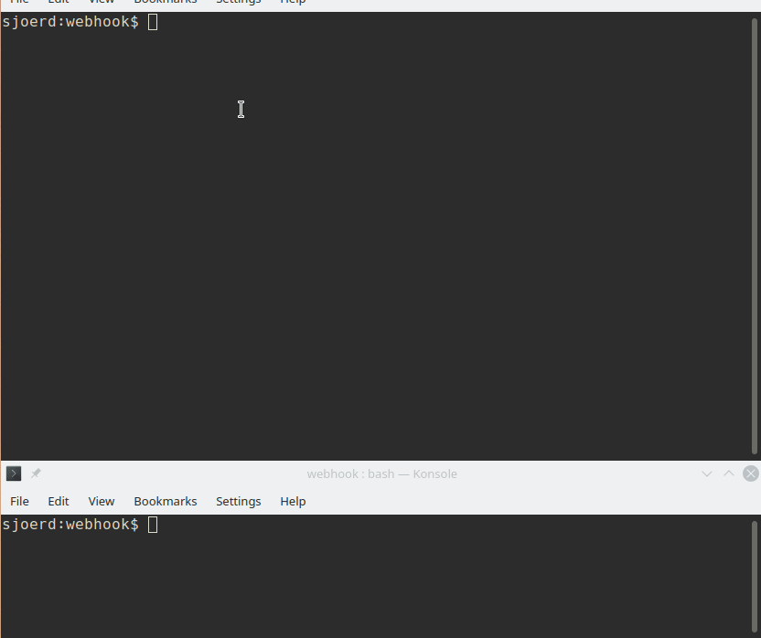

# IDIS webhook receiver example

An example implementation of a http POST listener that can listen to IDIS (Image DeIdentification Service) webhook events.

## requirements
* Python 3.7+

## Installation
* [Clone this repo](https://docs.github.com/en/github/creating-cloning-and-archiving-repositories/cloning-a-repository-from-github/cloning-a-repository) 
* Install dependencies: `pip install -r requirements.txt`

## Running the listener
* Open a terminal in the folder where you cloned the repo
* Run `python start-receiver.py`
* The listener should now be running. 

## Testing the listener
* Open a second terminal in the folder where you cloned the repo
* Run `python send_test_event.py`
* This will send the example content the receiver (see below)

 

 

   

